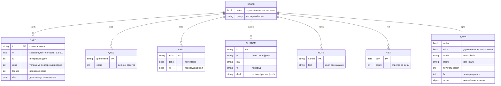
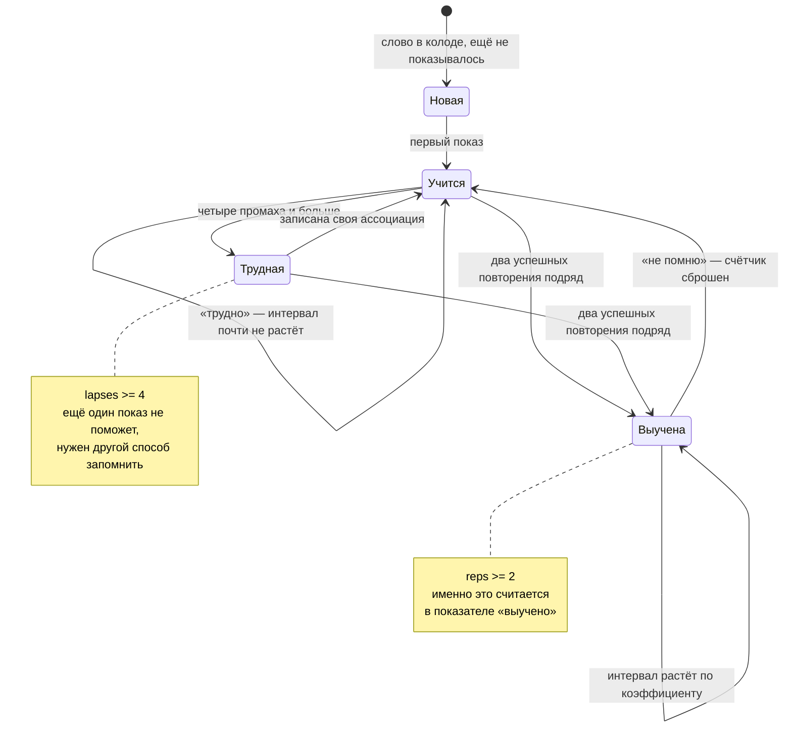
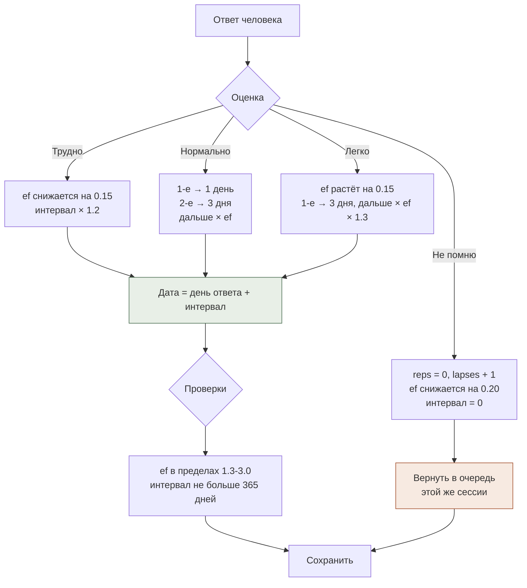
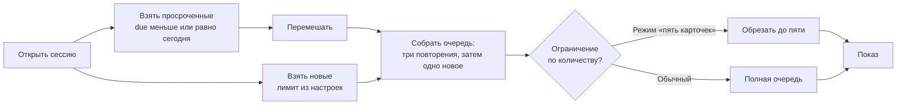
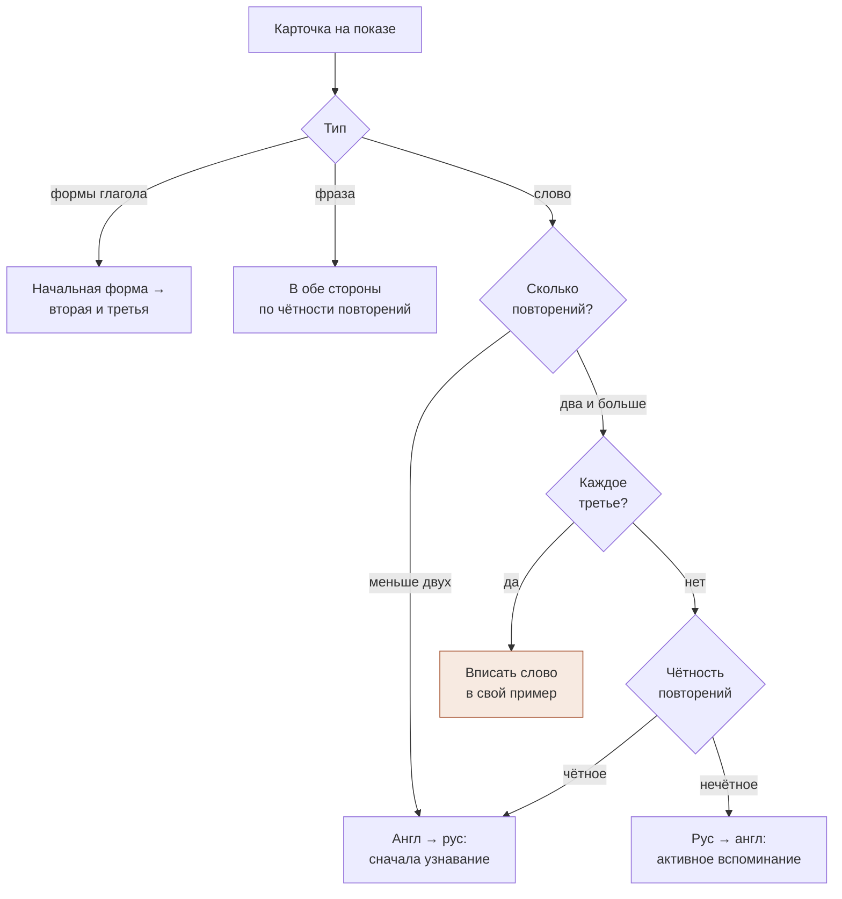
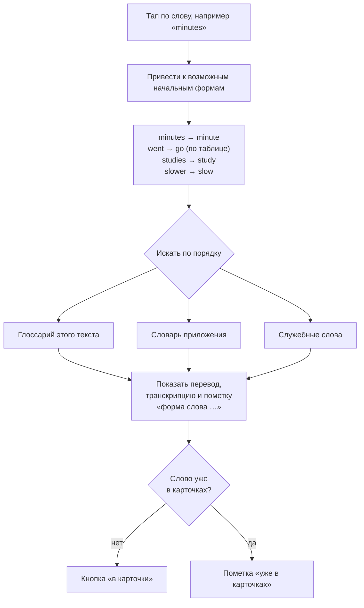
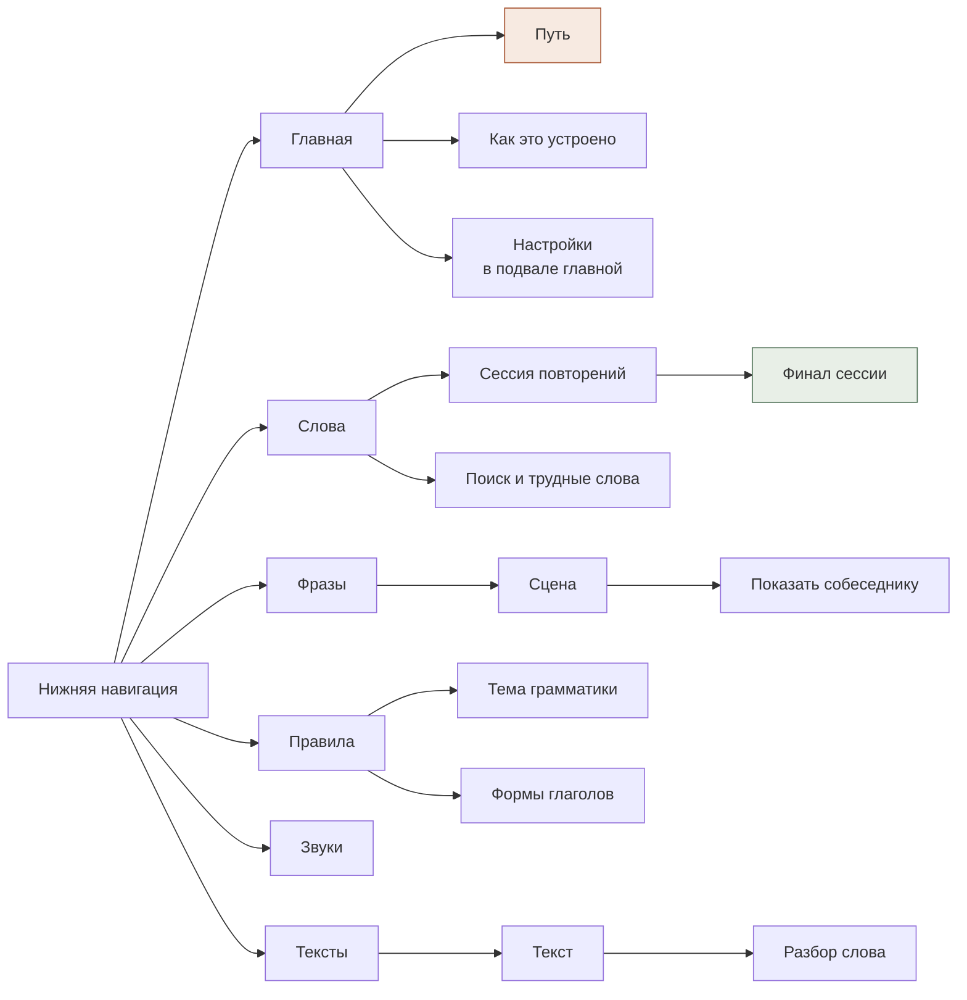

# Модель данных и потоки

Схемы написаны на Mermaid — GitHub рисует их прямо в документе.

---

## 1. Состояние приложения

Всё, что знает приложение о человеке, лежит в одном объекте `S` в `localStorage`. Учебный материал в состояние не входит: он задан в коде и одинаков у всех.

**Ключи карточек кодируют их тип** — это позволяет обходиться одним хранилищем для всех видов повторений:

| Вид | Ключ | Что спрашивается |
|---|---|---|
| Слово из колоды | `water` | значение или перевод |
| Слово, добавленное из текста | `curve` | то же |
| Фраза из разговорника | `p:help:2` | целиком, в обе стороны |
| Формы неправильного глагола | `v:go` | вторая и третья формы |

## 2. Жизненный цикл карточки

## 3. Как оценка превращается в дату

Ключевая деталь на схеме — **дата считается от дня ответа, а не от плановой даты показа**. Именно это делает пропуск безнаказанным: опоздание на три месяца не меняет ни интервал, ни коэффициент лёгкости.

## 4. Сборка сессии

Чередование «три повторения — одно новое» не даёт сессии превратиться в сплошной поток незнакомого: новое перемежается тем, что уже узнаётся.

## 5. Какой стороной спрашивать

Логика в том, что навыки разные и включаются по очереди: сначала узнать, потом вспомнить, потом достать из памяти и написать самой.

## 6. Разбор слова при тапе в тексте

Приведение к начальной форме — не косметика: без него половина слов в тексте осталась бы без перевода, потому что в живом тексте слова стоят в изменённых формах.

## 7. Экраны

## 8. Учебный материал в коде

Материал отделён от состояния и от логики — это позволяет проверять его отдельными скриптами.

| Структура | Что содержит | Объём |
|---|---|---|
| `DECKS` | Колоды слов: слово, транскрипция, перевод, часть речи, пример, перевод примера | 673 слова в 9 колодах |
| `IRREG` | Неправильные глаголы по группам образцов изменения | 76 глаголов в 7 группах |
| `GRAMMAR` | Темы: суть, «почему», сравнение, ловушка, примеры, тест | 20 тем, 60 вопросов |
| `TRIPS` | Сценарии разговорника: свои реплики и ответные | 27 сцен, 215 фраз |
| `TEXTS` | Тексты с построчным переводом и глоссарием | 12 текстов |
| `SOUNDS` | Звуки: схемы, шаги, ловушка, минимальные пары | 8 звуков |
| `COMMON` | Служебные слова и сокращения для разбора по тапу | ~300 записей |
| `BASIC` | Слова, считающиеся знакомыми при оценке сложности текста | ~130 слов |
